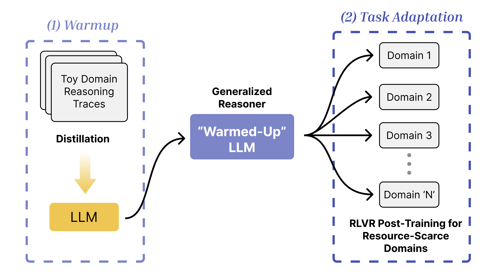

# Warmup Before You Train: Unlocking General Reasoning in Resource-Constrained Settings



This repository accompanies the paper:

📄 **[Warmup Before You Train: Unlocking General Reasoning in Resource-Constrained Settings](https://arxiv.org/abs/your_arxiv_id)**  
🤗 **[Find the model and data on Hugging Face Hub](https://huggingface.co/your-username/your-model-name](https://huggingface.co/collections/safal312/warmup-before-you-train-6829ddbc5e6f0c59f4a86a98)**

## 📄 Abstract

Designing effective reasoning-capable LLMs typically requires training using Reinforcement Learning with Verifiable Rewards (RLVR) or distillation with carefully curated Long Chain of Thoughts (CoT), both of which depend heavily on extensive training data. This creates a major challenge when the amount of quality training data is scarce. 
We propose a sample-efficient, two-stage training strategy to develop reasoning LLMs under limited supervision. In the first stage, we "warmup" the model by distilling Long CoTs from a toy domain, namely, Knights & Knaves (K&K) logic puzzles to acquire general reasoning skills. 
In the second stage, we apply RLVR to the warmed-up model using a limited set of target-domain examples. Our experiments demonstrate that this two-phase approach offers several benefits: 
- The warm-up phase alone facilitates generalized reasoning, leading to performance improvements across a range of tasks, including MATH, HumanEval\textsuperscript{+}, and MMLU-Pro.
- When both the base model and the warmed-up model are RLVR trained on the same small dataset (<=100 examples), the warmed-up model consistently outperforms the base model.
- Warming up before RLVR training allows a model to maintain cross-domain generalizability even after training on a specific domain.
- Introducing warmup in the pipeline not only improves accuracy but also overall sample efficiency during RLVR training.

## 📁 Repository Structure

```

.
├── train/                      # Training scripts and configs
│   ├── data/                  # K\&K data for Logic-RL
│   ├── \*.sh / \*.py / \*.yaml   # SFT and RLVR config/scripts
│   └── trl/                   # TRL library fork
│
├── evaluations/               # Evaluation scripts
│   ├── loaders for MATH, MMLU, HumanEval+
│   ├── eval\_run.sh            # End-to-end evaluation
│   └── example\_input.csv      # Input format example for evaluation
│
├── qwq\_sample.py              # Generate samples from QwQ
├── qwq\_samples.csv            # Example QwQ outputs
├── environment.yml            # Conda environment
└── README.md

```

---

## 📦 Included Tasks

* **Logic (K\&K puzzles)**
* **MATH**
* **HumanEval+**
* **MMLU-Pro**


## 📜 Citation

If you use this code, please cite:

```
@article{yourcitation2025warmup,
  title={Warmup Before You Train: Unlocking General Reasoning in Resource-Constrained Settings},
  author={Shrestha et al.},
  year={2025}
}
```
